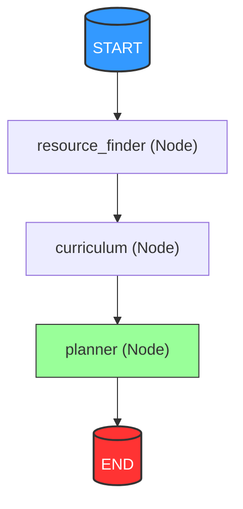
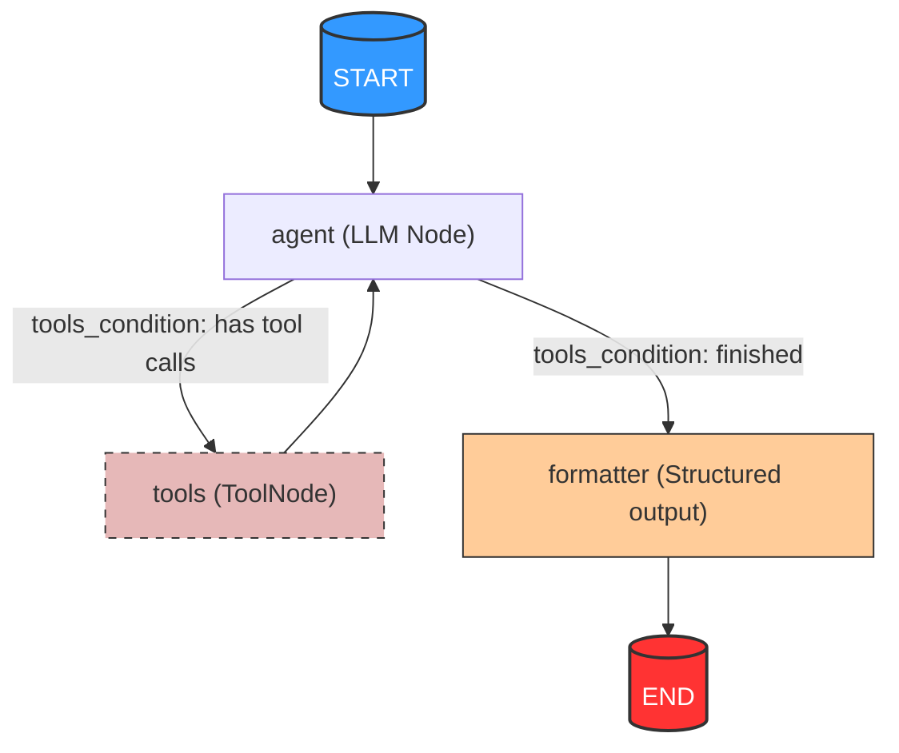

# Multi-Agent Learning Path Generator

An intelligent, multi-agent learning scheduler built using **LangGraph** and **FastAPI**. The system automatically generates structured week-by-week curricula, searches for relevant learning resources (via Tavily, YouTube, and GitHub SerpApi engines), and runs an LLM-based planning agent to merge them into a comprehensive learning schedule.

---

## 🛠️ Tech Stack & Concepts
- **FastAPI:** High-performance web framework for the API layer.
- **LangGraph:** Orchestrates the multi-agent execution pipeline using stateful graphs.
- **Pydantic:** Robust validation schemas for request/response bodies and tool validation.
- **SerpApi & Tavily:** Powers real-time search capabilities across Google (for GitHub repos), YouTube, and general web sources.
- **Groq (Llama-3):** Provides fast, cost-efficient, structured LLM reasoning.

---

## 📐 Architecture & Workflow

The generator executes a sequential pipeline workflow to ensure that the curriculum is structured precisely around the discovered resources:



### 1. Sequential Pipeline stages:
- **Resource Finder Agent (`resource_finder` node):** Runs a dedicated **agentic subgraph** to search for relevant online articles, documentation, videos, and GitHub repositories matching the learning goal.
- **Curriculum Agent (`curriculum` node):** Runs after resource discovery. It takes the list of actual found resources and designs a week-by-week syllabus, assigning each resource to the most relevant week.
- **Planner Agent (`planner` node):** Takes the mapped weeks and resources to construct logical learning phases. It defines detailed phase descriptions, learning objectives, assessments, and explains the phase's overall learning impact based on the assigned resources.

### 2. Resource Finder Subgraph:
The `resource_finder` runs a stateful loop that dynamically decides when to query Tavily (web articles), YouTube (lectures), or GitHub (codebases/repositories):



### 3. Planner Agent (`planner` node):
Once the parallel branches finish, their outputs (resources list + curriculum structure) are collected and fed into the `PlannerAgent`. The planner maps the resources to relevant weeks, designs learning objectives, plans assessments, and shapes the overall progression roadmap.

---

## 📁 Repository Structure

```
├── app/
│   ├── agents/            # Prompts and orchestrations for specific LLM roles
│   │   ├── base_agent.py
│   │   ├── curriculum_agent.py
│   │   ├── planner_agent.py
│   │   └── resource_finder.py
│   ├── api/               # API endpoints & routing handlers
│   │   └── routes.py
│   ├── graph/             # StateGraph pipelines & subgraphs
│   │   ├── builder.py
│   │   ├── resource_subgraph.py
│   │   └── state.py
│   ├── prompts/           # Prompts templates (YAML configs)
│   ├── schemas/           # Pydantic validation structures
│   │   ├── curriculum_schema.py
│   │   ├── planner_schema.py
│   │   ├── request_schema.py
│   │   └── resource_schema.py
│   ├── tools/             # Search engines tools configuration
│   │   ├── github_search.py
│   │   ├── youtube_search.py
│   │   ├── web_search.py
│   │   └── utils.py
│   ├── config.py          # Unified application configuration & Env loader
│   └── main.py            # FastAPI main instance config
├── main.py                # Root level server entrypoint script
├── pyproject.toml         # Python requirements & package configuration
└── README.md              # Documentation
```

---

## 🚀 Setup & Installation

### 1. Prerequisites
- **Python >= 3.13**
- A package manager (`pip` or `uv`)

### 2. Environment Setup
Clone the repository, create a virtual environment, and activate it:
```bash
python -m venv .venv
source .venv/bin/activate
```

Install the dependencies:
```bash
pip install -e .
```
*(Or if you use `uv`: `uv pip install -r pyproject.toml`)*

### 3. Configuration (`.env`)
Create a `.env` file in the root directory:
```env
GROQ_API_KEY=your_groq_api_key
TAVILY_API_KEY=your_tavily_api_key
SERPAPI_API_KEY=your_serpapi_api_key

# Optional settings
LLM_MODEL=llama-3.3-70b-versatile
LLM_TEMPERATURE=0.2
HOST=0.0.0.0
PORT=8000
```

---

## 🏃 Running the Application

Start the web application from the root directory:
```bash
python main.py
```
The server will boot up and reload on file changes. Access the interactive API docs at:
- Swagger UI: [http://localhost:8000/docs](http://localhost:8000/docs)
- Redoc: [http://localhost:8000/redoc](http://localhost:8000/redoc)

---

## 📡 API Endpoints

### 1. GET `/health`
Returns server operational status.
```json
{
  "status": "healthy",
  "service": "learning-path-agent"
}
```

### 2. POST `/generate-path`
Generates a complete validated schedule for a goal.

#### Request Body:
```json
{
  "goal": "FastAPI Web Apps",
  "level": "beginner",
  "duration_weeks": 4
}
```

#### Response Structure:
```json
{
  "goal": "FastAPI Web Apps",
  "level": "beginner",
  "duration_weeks": 4,
  "total_estimated_hours": 32,
  "recommended_pace": "8 hours/week",
  "phases": [
    {
      "phase": 1,
      "title": "Foundational Routing & Models",
      "description": "This phase lays the essential foundation for building backend APIs using FastAPI. Learners will dive deep into path parameters, query parameters, request bodies, Pydantic data validation schemas, and database setups with SQLAlchemy to build reliable CRUD endpoints.",
      "phase_impact": "This phase is crucial as it establishes core routing and request handling paradigms. The included FastAPI crash course and official docs ensure learners understand validation error patterns and standard middleware configuration.",
      "weeks": [1, 2],
      "topics": ["FastAPI path parameters", "SQLAlchemy basics", "Pydantic validation models"],
      "estimated_hours": 16,
      "resources": [
        {
          "title": "FastAPI Crash Course",
          "url": "https://youtube.com/...",
          "type": "Video",
          "rating": 4.8
        }
      ],
      "learning_objectives": ["Implement request models", "Create database migrations"],
      "prerequisites": ["Python basics"],
      "assessment": "Build a CRUD app for a simple contact list."
    }
  ],
  "progression_flow": "Start with Phase 1 to grasp dependency injection, then progress to Phase 2 for async operations.",
  "milestones": [
    "Successfully build a running backend local mock app in week 2."
  ],
  "tips_for_success": [
    "Use standard docs (fastapi.tiangolo.com) directly as a primary companion resource."
  ]
}
```
